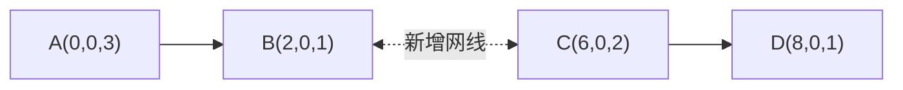

# 路由器覆盖范围

## 题目描述

给定一组路由器信息 `routers`，其中每个元素为 `(x, y, r)`，表示一个路由器的中心坐标为 `(x, y)`，覆盖半径为 `r`。

如果路由器 `A` 的覆盖范围能够覆盖路由器 `B` 的中心点，则称信息可以从 `A` 扩散到 `B`。

更具体地说，对于两个不同的路由器 `i` 和 `j`：

```text
如果 distance((xi, yi), (xj, yj)) <= ri
则信息可以从 i 传到 j
```

注意这里的扩散是**有方向的**：

- `A` 能覆盖 `B`，不代表 `B` 一定能覆盖 `A`
- 是否能扩散，只取决于发送方自己的覆盖半径

现在允许你在**任意两个不同的路由器之间额外连接一根网线**。  
这根网线可以让这两个路由器之间的信息**双向传播**。

你可以自由选择：

- 要连接网线的两个路由器
- 信息扩散的起点路由器

请返回：**在最优连线方案下，从某一个起点开始，最多能扩散到多少个路由器（包含起点自身）**。

## 函数说明

```python
def max_count(routers: List[Tuple[int, int, int]]) -> int:
    pass
```

## 输入说明

- 输入为一个数组 `routers`
- `routers[i] = (x, y, r)` 表示第 `i` 个路由器的坐标和覆盖半径
- 所有坐标和半径均为整数

## 输出说明

- 输出一个整数，表示新增一条网线后，选择最佳起点能够扩散到的最大路由器数量

## 规则说明

1. 路由器之间原有的“覆盖扩散”关系是单向的。
2. 额外新增的网线只有一条，但它是双向的。
3. 扩散可以经过多个中间路由器继续传递。
4. 统计结果时，起点路由器也算在内。

## 示意图

下面先看一个简化示意：



说明：

- `A` 的覆盖范围包含 `B` 的中心点，所以信息可以从 `A` 传到 `B`
- `C` 的覆盖范围包含 `D` 的中心点，所以信息可以从 `C` 传到 `D`
- 原本 `A/B` 与 `C/D` 两部分不连通
- 如果给 `B` 和 `C` 之间加一根双向网线，那么从 `A` 出发可以传播：

```text
A -> B <-> C -> D
```

最终可到达 `A、B、C、D` 共 `4` 个路由器。

## 样例

**输入：**

```python
routers = [
    (5, 6, 2),
    (7, 6, 1),
    (6, 5, 1),
    (4, 3, 2),
    (6, 3, 1),
    (7, 3, 1),
    (1, 5, 4),
    (2, 1, 3),
]
```

**输出：**

```python
7
```

## 样例解释

根据这些路由器的位置和覆盖半径，可以得到以下扩散关系：

- 路由器 `0` 可以把信息传给 `1` 和 `2`
- 路由器 `3` 可以把信息传给 `4`
- 路由器 `4` 和 `5` 可以互相传递信息
- 路由器 `6` 和 `7` 都可以把信息传给 `3`

例如，给路由器 `0` 和路由器 `6` 之间加一根双向网线：

```text
0 <-> 6
```

此时从路由器 `6` 出发，可以传播到：

```text
6 -> 0 -> 1
6 -> 0 -> 2
6 -> 3 -> 4 -> 5
```

因此一共可以到达：

```text
6, 0, 1, 2, 3, 4, 5
```

总计 `7` 个路由器。

## 补充说明

- 如果 `routers` 为空，返回 `0`
- 如果只有一个路由器，答案为 `1`
- 一条网线接在哪两个路由器之间，会直接影响信息最终能传播到哪些设备

## 一句话总结

这道题的本质是：

**在已有覆盖传播规则的基础上，额外连接一条双向网线，并选择一个最佳起点，使最终能收到信息的路由器数量最多。**
