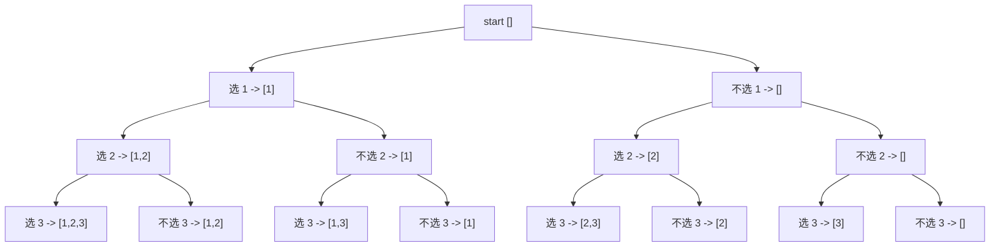
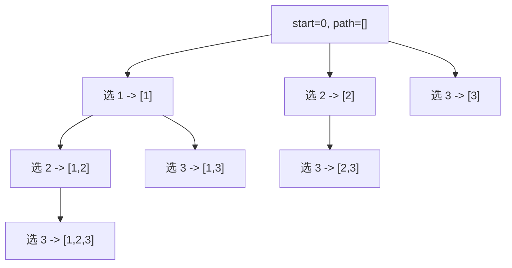
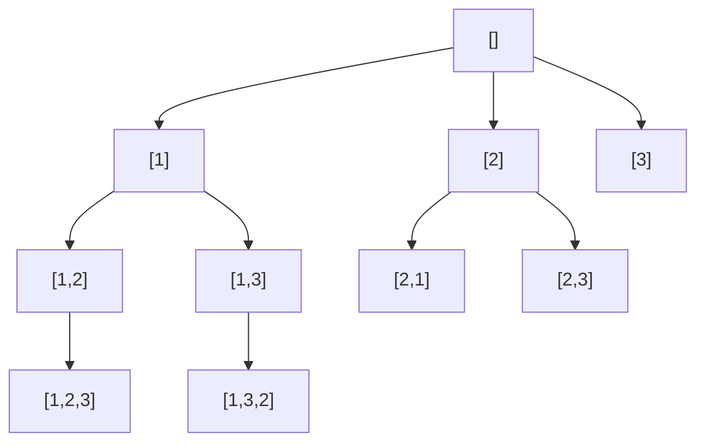
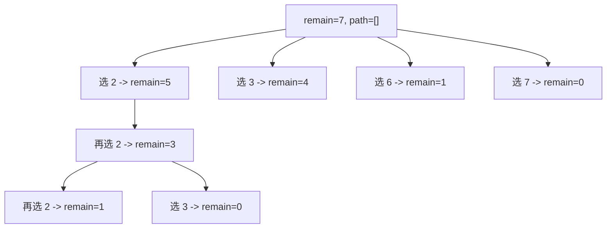

# 回溯算法由浅入深

## 1. 回溯算法是什么

回溯，本质上是一种`试错 + 撤销`的搜索方法。

它的核心思路是：

1. 先做一个选择
2. 继续往下搜索
3. 如果发现这条路走不通，撤销刚才的选择
4. 回到上一步，尝试别的选择

所以很多人会把回溯理解成：

`深度优先搜索（DFS） + 状态恢复`

它特别适合解决这类问题：

- 枚举所有可能方案
- 在很多选择中找满足条件的方案
- 组合、排列、子集问题
- 棋盘搜索
- 约束满足问题，比如 N 皇后、数独

---

## 2. 一个最直观的理解

假设你要从数字 `[1, 2, 3]` 中选出所有子集。

对于每个数字，其实都只有两个选择：

- 选它
- 不选它

这就天然形成了一棵决策树。



回溯就是沿着这棵树一直往下走，走完一条分支后，再退回来走另一条。

---

## 3. 回溯和暴力枚举的关系

回溯并不是“不是暴力”。

更准确地说：

- 回溯本来就是一种有组织的暴力搜索
- 它比无脑枚举更系统
- 它可以在搜索过程中做`剪枝`

所以回溯真正强的地方不只是“搜”，而是：

- 搜索路径清晰
- 容易恢复现场
- 容易提前终止无效分支

---

## 4. 回溯模板

最经典的回溯模板长这样：

```python
def backtrack(路径, 选择列表):
    if 满足结束条件:
        收集答案
        return

    for 选择 in 选择列表:
        做选择
        backtrack(新路径, 新选择列表)
        撤销选择
```

如果你把它翻译成大白话，就是：

- 先判断当前状态是不是已经得到一个答案
- 如果还没结束，就枚举下一步所有可能选择
- 对每个选择：
  - 先选
  - 再递归往下
  - 最后撤销

其中最关键的两个动作是：

- `做选择`
- `撤销选择`

这两个动作一定要成对出现。

---

## 5. 第一个例题：求所有子集

题目：

给定一个数组 `nums`，返回它的所有子集。

例如：

```python
nums = [1, 2, 3]
```

答案包含：

```python
[[], [1], [2], [3], [1,2], [1,3], [2,3], [1,2,3]]
```

### 5.1 思路

从左到右，每个位置都可以决定：

- 选当前数
- 跳过当前数

也可以写成另一种更常见的回溯形式：

- 当前路径先加入答案
- 然后从当前位置开始，继续尝试后续元素

### 5.2 代码

```python
def subsets(nums):
    result = []
    path = []

    def backtrack(start):
        result.append(path[:])

        for i in range(start, len(nums)):
            path.append(nums[i])
            backtrack(i + 1)
            path.pop()

    backtrack(0)
    return result
```

### 5.3 过程图



### 5.4 这里为什么要 `path[:]`

因为 `path` 是一个会不断修改的列表。

如果你直接 `result.append(path)`，后面 `path.pop()` 会影响已经存进去的结果。

所以这里必须拷贝一份当前路径。

---

## 6. 第二个例题：全排列

题目：

给定 `nums = [1,2,3]`，返回所有排列。

例如：

```python
[
    [1,2,3],
    [1,3,2],
    [2,1,3],
    [2,3,1],
    [3,1,2],
    [3,2,1]
]
```

### 6.1 和子集问题有什么不同

子集问题里，一个元素可以“不选”。

排列问题里，每个位置都要选一个还没用过的数字，而且顺序不同算不同答案。

所以我们通常需要一个 `used` 数组表示某个元素是否已经被选过。

### 6.2 代码

```python
def permute(nums):
    result = []
    path = []
    used = [False] * len(nums)

    def backtrack():
        if len(path) == len(nums):
            result.append(path[:])
            return

        for i in range(len(nums)):
            if used[i]:
                continue

            used[i] = True
            path.append(nums[i])

            backtrack()

            path.pop()
            used[i] = False

    backtrack()
    return result
```

### 6.3 决策树示意



### 6.4 回溯点在哪里

以这几行代码为例：

```python
used[i] = True
path.append(nums[i])

backtrack()

path.pop()
used[i] = False
```

前两行是“做选择”，后两行是“撤销选择”。

这就是回溯最标准的结构。

---

## 7. 第三个例题：组合总和

题目：

给定无重复数组 `candidates` 和目标值 `target`，找出所有和为 `target` 的组合。

例如：

```python
candidates = [2, 3, 6, 7]
target = 7
```

答案：

```python
[[2, 2, 3], [7]]
```

### 7.1 为什么这是回溯经典题

因为这题既要搜索，又要剪枝。

如果你不做剪枝，搜索树会很大。

### 7.2 代码

```python
def combination_sum(candidates, target):
    result = []
    path = []
    candidates.sort()

    def backtrack(start, remain):
        if remain == 0:
            result.append(path[:])
            return

        for i in range(start, len(candidates)):
            num = candidates[i]

            if num > remain:
                break

            path.append(num)
            backtrack(i, remain - num)
            path.pop()

    backtrack(0, target)
    return result
```

### 7.3 这题的关键剪枝

```python
if num > remain:
    break
```

因为数组已经排好序了。

当前数字都比剩余目标大，后面的数字只会更大，所以整条分支都不用再搜了。

这就是剪枝。

### 7.4 搜索树示意

以 `candidates = [2,3,6,7], target = 7` 为例：



最终答案是：

- `[2,2,3]`
- `[7]`

---

## 8. 第四个例题：N 皇后

这是回溯里非常有代表性的约束搜索问题。

题目：

在 `n x n` 棋盘上放 `n` 个皇后，使得任意两个皇后都不能互相攻击。

皇后攻击范围：

- 同一行
- 同一列
- 同一对角线

### 8.1 为什么适合回溯

因为你可以一行一行放皇后：

- 当前行尝试每一列
- 如果当前位置合法，就继续放下一行
- 如果不合法，就换列
- 如果下一层失败，就撤销当前皇后

### 8.2 棋盘示意

下面以 `n = 4` 为例，给出一个合法解：

```text
. Q . .
. . . Q
Q . . .
. . Q .
```

### 8.3 代码

```python
def solve_n_queens(n):
    result = []
    board = [["."] * n for _ in range(n)]
    cols = set()
    diag1 = set()  # row - col
    diag2 = set()  # row + col

    def backtrack(row):
        if row == n:
            result.append(["".join(line) for line in board])
            return

        for col in range(n):
            if col in cols or (row - col) in diag1 or (row + col) in diag2:
                continue

            board[row][col] = "Q"
            cols.add(col)
            diag1.add(row - col)
            diag2.add(row + col)

            backtrack(row + 1)

            board[row][col] = "."
            cols.remove(col)
            diag1.remove(row - col)
            diag2.remove(row + col)

    backtrack(0)
    return result
```

### 8.4 为什么不用每次都扫描棋盘

因为如果每放一个皇后，都遍历整张棋盘判断是否合法，效率会很差。

这里用了三个集合：

- `cols` 记录已经占用的列
- `diag1` 记录主对角线
- `diag2` 记录副对角线

这样判断一个位置能不能放皇后，就从`扫描棋盘`变成了`O(1) 查集合`。

这类优化虽然不改变问题本质，但能明显提升回溯效率。

---

## 9. 回溯的通用思考框架

你拿到一道题，可以按下面顺序思考：

### 9.1 第一步：状态是什么

也就是“递归函数的参数是什么”。

常见状态包括：

- 当前处理到第几个元素
- 当前路径 `path`
- 当前已经选了哪些数
- 当前剩余目标值
- 当前棋盘状态

### 9.2 第二步：选择是什么

也就是“这一层能做什么决定”。

比如：

- 选哪个数字
- 放在哪一列
- 当前元素选还是不选

### 9.3 第三步：结束条件是什么

比如：

- 路径长度等于数组长度
- 当前和刚好等于目标
- 行号已经走到 `n`

### 9.4 第四步：怎么撤销

这是很多初学者最容易漏的。

要问自己：

- 我刚才改了哪些状态？
- 递归回来之后，哪些东西需要恢复？

如果恢复不完整，答案一定会错。

---

## 10. 回溯中的剪枝

回溯题能不能做得漂亮，关键常常不在“会不会搜”，而在“会不会剪”。

### 10.1 什么是剪枝

剪枝就是：

在搜索过程中，提前判断某条分支不可能产生合法答案，于是直接停止搜索。

### 10.2 常见剪枝方式

#### 方式一：超过目标值直接停

例如组合总和中：

```python
if remain < 0:
    return
```

#### 方式二：排序后提前结束

```python
if candidates[i] > remain:
    break
```

#### 方式三：去重

在“有重复元素的排列/组合”里，常见写法：

```python
if i > 0 and nums[i] == nums[i - 1] and not used[i - 1]:
    continue
```

#### 方式四：明显不合法的状态提前返回

例如 N 皇后里，某位置被攻击，就直接跳过，不进入下一层。

---

## 11. 回溯和 DFS 的关系

两者关系非常近。

可以这样理解：

- DFS 强调的是“搜索顺序”
- 回溯强调的是“搜索后要恢复状态”

很多题里，这两个词几乎是一起出现的。

但如果你要区分：

- 只是一条路走到底，未必叫回溯
- 做了选择、递归、撤销，再继续试别的选择，这才是典型回溯

---

## 12. 回溯为什么经常慢

因为它通常要枚举大量可能性。

例如：

- 子集问题规模常是 `O(2^n)`
- 排列问题规模常是 `O(n!)`

所以回溯题有两个重点：

- 会写正确
- 会做剪枝

很多时候，题目能否通过，差别就在剪枝上。

---

## 13. 初学者最常见的错误

### 13.1 忘记撤销选择

比如只写了：

```python
path.append(nums[i])
backtrack(...)
```

却忘了：

```python
path.pop()
```

这会导致后续分支使用了错误状态。

### 13.2 收集答案时没有拷贝

错误写法：

```python
result.append(path)
```

正确写法：

```python
result.append(path[:])
```

### 13.3 递归参数设计混乱

比如明明需要 `start` 来控制组合顺序，却忘了传，结果出现重复答案。

### 13.4 剪枝条件写错

尤其是在“排序 + 去重”问题里，`continue` 和 `break` 的使用场景很容易混淆。

---

## 14. 一套万能检查表

以后你写回溯题，可以拿这个检查表过一遍：

- 递归函数参数是否准确描述当前状态？
- 结束条件是否完整？
- 当前层的选择有哪些？
- 做选择后，哪些状态发生变化？
- 返回上一层前，是否全部恢复？
- 收集答案时，是否做了拷贝？
- 是否存在可用的剪枝？
- 是否会产生重复答案？

---

## 15. 一个通用回溯模板

这是最常用、最值得背下来的版本：

```python
def backtrack(状态参数):
    if 终止条件:
        收集答案
        return

    for 选择 in 当前层所有选择:
        if 这个选择不合法:
            continue

        做选择
        backtrack(下一层状态)
        撤销选择
```

如果题目允许剪枝，还可以加：

```python
def backtrack(状态参数):
    if 当前状态已经不可能得到答案:
        return

    if 终止条件:
        收集答案
        return

    for 选择 in 当前层所有选择:
        if 不合法:
            continue

        做选择
        backtrack(下一层状态)
        撤销选择
```

---

## 16. 什么时候该想到回溯

如果题目出现下面这些关键词，你就应该优先想到回溯：

- 所有方案
- 所有排列
- 所有组合
- 所有子集
- 找出所有满足条件的路径
- 棋盘放置
- 约束搜索

如果题目问的是：

- 是否存在一种方案
- 找任意一种方案

很多时候也可以用回溯，只不过可以在找到答案后提前结束。

---

## 17. 建议的刷题顺序

如果你要系统练回溯，建议按这个顺序：

1. 子集
2. 组合
3. 排列
4. 含重复元素的组合 / 排列
5. 组合总和
6. 分割字符串
7. N 皇后
8. 数独

这个顺序的好处是：

- 先掌握基本模板
- 再理解 `start`、`used`
- 再理解去重和剪枝
- 最后做复杂约束搜索

---

## 18. 总结

回溯算法可以浓缩成一句话：

`在一棵决策树上深度优先搜索，边搜索边恢复现场。`

你真正需要掌握的不是死记代码，而是下面四件事：

1. 当前状态是什么
2. 当前有哪些选择
3. 什么时候结束
4. 如何撤销这一步

只要这四件事想清楚，大部分回溯题都能写出来。

---

## 19. 练习题推荐

可以按这个顺序自己再做一遍：

1. 子集
2. 子集 II
3. 全排列
4. 全排列 II
5. 组合
6. 组合总和
7. 电话号码的字母组合
8. 复原 IP 地址
9. 分割回文串
10. N 皇后

---

## 20. 送你一个记忆口诀

回溯四步：

`判断结束 -> 枚举选择 -> 做选择 -> 撤销选择`

如果你以后写着写着乱了，就回到这四步。
