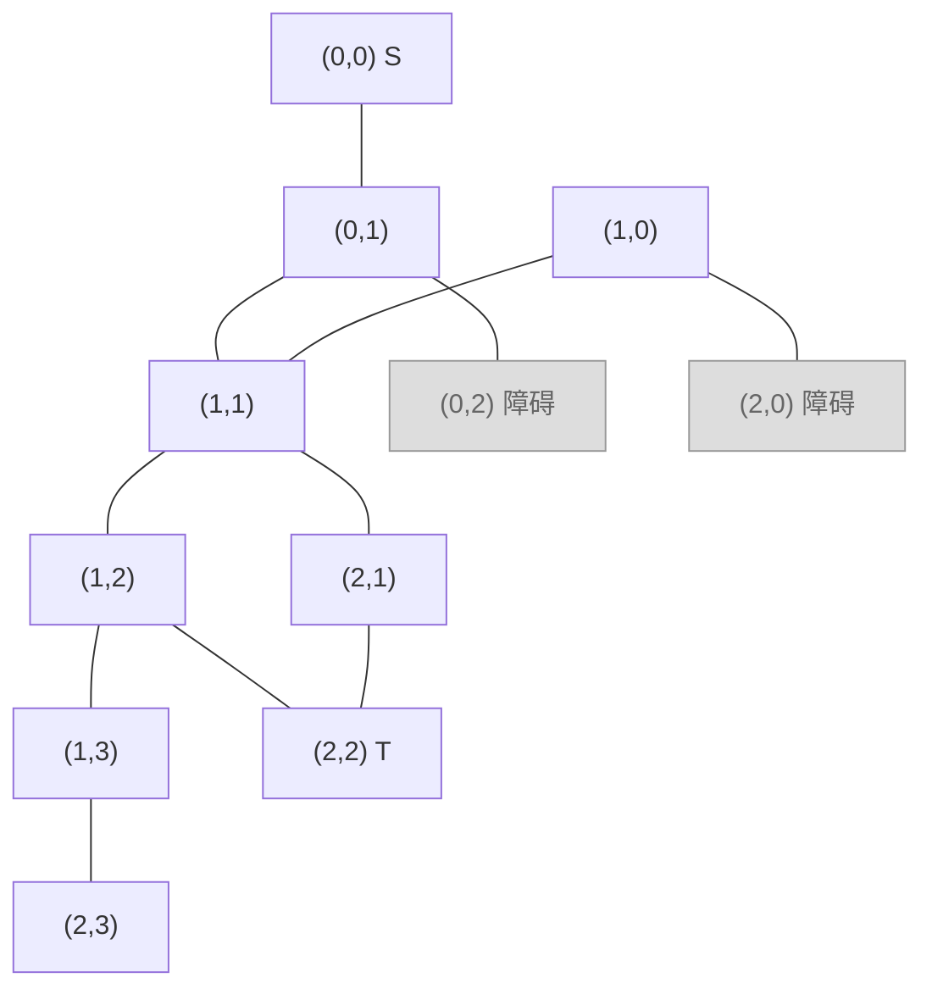
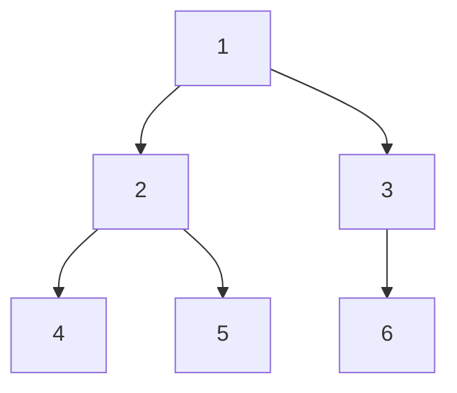
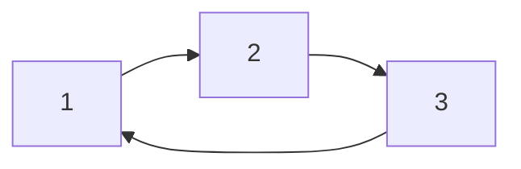
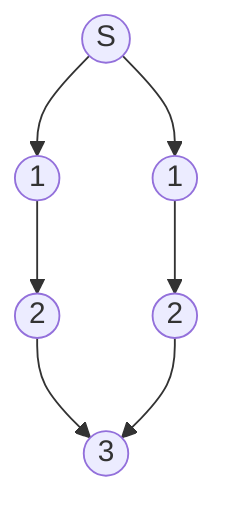
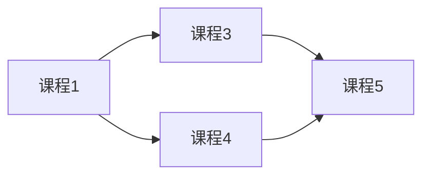
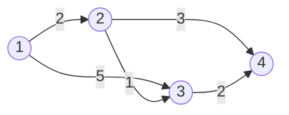
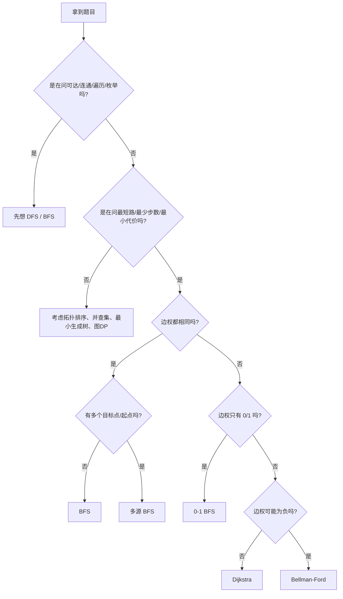

# 图论搜索算法总结

## 1. 这篇文档解决什么问题

很多人学图论时，不是真的不会写代码，而是会在下面几个问题上反复卡住：

- 题目到底是不是图论题
- 这是遍历问题，还是最短路问题
- 应该用 DFS、BFS，还是 Dijkstra
- 为什么有的题是多源 BFS，有的题却必须用 Dijkstra
- 模板会写，但一换题面就认不出来

这篇文档不只讲定义，还重点讲三件事：

1. 怎么识别题型
2. 为什么要用这个算法
3. 具体题目里这个算法是怎么落地的

---

## 2. 先学会建模

很多题目不说“图”，但本质就是图。

### 2.1 显式图

题目直接给点和边：

- 路由器和网线
- 城市和道路
- 课程和先修关系
- 社交账号和好友关系

这类题通常直接建邻接表。

例如：

```text
1 -- 2
|    |
3 -- 4
```

可以建成：

```python
graph = {
    1: [2, 3],
    2: [1, 4],
    3: [1, 4],
    4: [2, 3],
}
```

### 2.2 网格图

二维矩阵也是图。

核心理解：

- 每个格子是一个点
- 相邻格子之间有边
- 相邻通常指上、下、左、右
- 某些题会额外允许左上、右上、左下、右下，也就是 8 个方向

看这个更直观的例子：

```text
坐标版矩阵：

        c0      c1      c2      c3
      +------+------+------+------+
r0    | S    | 0    | #    | 0    |
      +------+------+------+------+
r1    | 0    | 0    | 0    | 0    |
      +------+------+------+------+
r2    | #    | 0    | T    | 0    |
      +------+------+------+------+

S: 起点
T: 终点
#: 障碍，不能走
0: 可通行
```

如果只允许上下左右移动，那么图上的边关系是：



但这里有一个很重要的建模细节：

- 障碍格虽然在矩阵里存在
- 但你做搜索时，通常把它当作“不能扩展的点”
- 也就是访问到它时直接跳过

所以网格题本质上就是在一个“隐式图”上做搜索。  
你不需要真的把所有边建出来，通常直接通过方向数组临时生成邻居：

```python
for dx, dy in [(1, 0), (-1, 0), (0, 1), (0, -1)]:
    nx, ny = x + dx, y + dy
```

网格图常见题型：

- 岛屿数量
- 迷宫最短路
- 腐烂的橘子
- 最近仓库 / 最近医院 / 最近门
- 最小障碍移除

### 2.3 状态图

状态图是最容易让人一开始不适应的。

它不是“地点和地点之间连边”，而是“状态和状态之间连边”。

例如：

- 单词接龙：一个单词变到另一个单词
- 打开转盘锁：一个密码状态变到下一个密码状态
- 访问所有节点：`(当前点, 已访问集合)` 才是一个状态

例子：

```text
"0000" -> "1000"
"0000" -> "9000"
"0000" -> "0100"
"0000" -> "0900"
...
```

这些不是地理上的点，但它们是搜索图中的点。

你以后只要看到“每次操作可以把当前状态变成另一个状态”，就要开始往状态图上想。

---

## 3. 先用一句话区分几种常见算法

| 算法 | 一句话理解 | 最典型用途 |
| --- | --- | --- |
| DFS | 一条路走到底，再回退 | 连通块、枚举、递归搜索、判环 |
| BFS | 一层一层向外扩散 | 无权最短路、最少步数 |
| 多源 BFS | 多个起点同时扩散 | 最近目标点距离 |
| 拓扑排序 | 按依赖顺序处理 DAG | 课程依赖、任务调度 |
| Dijkstra | 非负带权最短路 | 最小时延、最小费用 |
| 0-1 BFS | 边权只有 0/1 的最短路 | 最少修改、最少障碍 |
| Bellman-Ford | 可处理负权边的最短路 | 限定边数、负权边 |
| Floyd | 任意两点最短路 | 小图多次查询 |
| 双向 BFS | 两头同时搜 | 大状态空间无权最短路 |

---

## 4. DFS

## 4.1 核心思想

DFS，Depth First Search，深度优先搜索。

它的搜索顺序是：

- 先沿着一条路尽量走到底
- 走不下去了再回退
- 再走别的分支

图示：



从 `1` 开始 DFS，可能的访问顺序是：

```text
1 -> 2 -> 4 -> 回退 -> 5 -> 回退 -> 回退 -> 3 -> 6
```

### 4.2 DFS 最适合干什么

DFS 特别适合这些问题：

- 判断连不连通
- 计算连通块数量
- 枚举所有路径
- 回溯搜索
- 树形递归
- 有向图判环
- 用后序顺序做拓扑排序

一句话总结：

`你更关心“搜全”“搜深”“递归处理”，就优先想到 DFS。`

### 4.3 DFS 不适合什么

DFS 不适合：

- 无权图最短路
- 最少步数问题

原因很简单：

DFS 第一次走到终点，不保证是最短到达。

### 4.4 基本模板

```python
def dfs(node):
    visited.add(node)

    for nxt in graph[node]:
        if nxt in visited:
            continue
        dfs(nxt)
```

### 4.5 网格 DFS 模板

```python
def dfs(x, y):
    visited[x][y] = True

    for dx, dy in directions:
        nx, ny = x + dx, y + dy
        if 0 <= nx < rows and 0 <= ny < cols:
            if not visited[nx][ny] and grid[nx][ny] == 1:
                dfs(nx, ny)
```

## 4.6 经典题详解一：岛屿数量

### 题意

给你一个二维网格：

- `1` 表示陆地
- `0` 表示海水

问一共有多少个岛屿。

一个岛屿的定义是：

- 若干个上下左右连在一起的 `1`

### 为什么这是 DFS 题

因为这题本质不是求最短路，而是：

- 找出所有由 `1` 组成的连通块
- 每找到一个新的连通块，答案加 1

这和 DFS 的强项完全一致。

### 示例

```text
1 1 0 0 0
1 1 0 0 1
0 0 0 1 1
0 0 0 0 0
1 0 1 0 1
```

图形上可以看成：

```text
岛1: 左上角那一团
岛2: 右上那一团
岛3: 左下单点
岛4: 中下单点
岛5: 右下单点
```

答案是 `5`。

### 搜索过程

从左到右、从上到下扫矩阵：

1. 扫到 `(0,0)` 是 `1`，说明发现一个新岛
2. 从 `(0,0)` 开始 DFS，把和它连通的所有 `1` 全部标记掉
3. 继续扫描，直到遇到下一个没访问过的 `1`

### 你真正要抓住的核心

这里 DFS 干的不是“找路”，而是“扩散并染色”。

代码思路：

```python
def num_islands(grid):
    rows, cols = len(grid), len(grid[0])
    visited = [[False] * cols for _ in range(rows)]

    def dfs(x, y):
        visited[x][y] = True
        for dx, dy in [(1, 0), (-1, 0), (0, 1), (0, -1)]:
            nx, ny = x + dx, y + dy
            if 0 <= nx < rows and 0 <= ny < cols:
                if grid[nx][ny] == "1" and not visited[nx][ny]:
                    dfs(nx, ny)

    ans = 0
    for i in range(rows):
        for j in range(cols):
            if grid[i][j] == "1" and not visited[i][j]:
                ans += 1
                dfs(i, j)

    return ans
```

### 这题最容易犯的错误

- 没有 `visited`
- 把对角线也当成连通
- 发现一个 `1` 后只 `ans += 1`，却没有把整块陆地搜完

## 4.7 经典题详解二：课程表中的 DFS 判环

### 题意

有 `n` 门课程，某些课程有先修关系：

```text
要学 A，必须先学 B
```

问能否学完所有课程。

### 这题为什么是图

把课程看成点，把依赖关系看成有向边：

```text
B -> A
```

意思是先修 `B`，再学 `A`。

### 什么时候学不完

只要图里存在环，就学不完。

例如：

```text
1 -> 2 -> 3 -> 1
```

谁都要等别人先学，死锁。

### DFS 怎么判环

常用三色标记：

- `0`：没访问
- `1`：正在递归栈里
- `2`：已经彻底访问完成

如果你在 DFS 过程中，遇到一个状态为 `1` 的点，说明回到了当前递归路径上的祖先节点，存在环。

### 图示



### 模板

```python
def can_finish(num_courses, prerequisites):
    graph = [[] for _ in range(num_courses)]
    for a, b in prerequisites:
        graph[b].append(a)

    state = [0] * num_courses

    def dfs(node):
        if state[node] == 1:
            return False
        if state[node] == 2:
            return True

        state[node] = 1
        for nxt in graph[node]:
            if not dfs(nxt):
                return False
        state[node] = 2
        return True

    for i in range(num_courses):
        if state[i] == 0 and not dfs(i):
            return False
    return True
```

### 这题训练的不是 DFS 模板，而是“图上的状态设计”

你要学会把：

- “正在访问”
- “访问完成”

这种过程信息编码进数组里。

---

## 5. BFS

## 5.1 核心思想

BFS，Breadth First Search，广度优先搜索。

它的特点不是“会用队列”，而是：

- 它按层扩散
- 距离起点越近的层，越早处理

图示：



括号里的数字可以理解成：

- 距离
- 层数
- 操作步数

### 5.2 BFS 最适合干什么

题目里如果出现这些字眼，优先想 BFS：

- 最少步数
- 最少操作次数
- 无权最短路
- 网格最短路
- 状态图最短路

一句话：

`只要每次移动/操作的代价都一样，BFS 往往就是最短路。`

### 5.3 为什么 BFS 能求无权最短路

因为它是一层一层来的。

起点距离是 `0`。  
所有一步能到的点距离都是 `1`。  
所有两步能到的点距离都是 `2`。

所以某个点第一次被访问到时，一定就是最短距离。

### 5.4 基本模板

```python
from collections import deque


def bfs(start):
    queue = deque([start])
    dist = {start: 0}

    while queue:
        node = queue.popleft()

        for nxt in graph[node]:
            if nxt in dist:
                continue
            dist[nxt] = dist[node] + 1
            queue.append(nxt)
```

## 5.5 经典题详解一：二进制矩阵中的最短路径

### 题意

给你一个矩阵：

- `0` 表示可以走
- `1` 表示障碍

从左上角走到右下角，求最短路径长度。

### 为什么是 BFS

因为：

- 每走一步代价都一样
- 题目要“最短路径长度”

这就是 BFS 的标准适用条件。

### 过程图

```text
0 0 1
1 0 1
1 0 0
```

从起点开始按层扩展：

```text
第0层: (0,0)
第1层: (0,1)
第2层: (1,1)
第3层: (2,1)
第4层: (2,2)
```

因此最短路径长度和层数直接相关。

### 代码骨架

```python
from collections import deque


def shortest_path(grid):
    rows, cols = len(grid), len(grid[0])
    if grid[0][0] == 1 or grid[rows - 1][cols - 1] == 1:
        return -1

    queue = deque([(0, 0)])
    dist = [[-1] * cols for _ in range(rows)]
    dist[0][0] = 1

    while queue:
        x, y = queue.popleft()
        if (x, y) == (rows - 1, cols - 1):
            return dist[x][y]

        for dx, dy in [(-1, -1), (-1, 0), (-1, 1),
                       (0, -1),           (0, 1),
                       (1, -1),  (1, 0),  (1, 1)]:
            nx, ny = x + dx, y + dy
            if 0 <= nx < rows and 0 <= ny < cols:
                if grid[nx][ny] == 0 and dist[nx][ny] == -1:
                    dist[nx][ny] = dist[x][y] + 1
                    queue.append((nx, ny))

    return -1
```

### 你应该学到什么

这题真正训练的是：

- BFS 的“第一次到达即最短”
- 网格图的邻居生成
- `dist` 数组既能记距离，也能兼做 `visited`

## 5.6 经典题详解二：打开转盘锁

### 题意

四位密码锁，从 `"0000"` 出发，每次可以把某一位加一或减一，求最少几步到目标密码。

### 这是图吗

是，而且是状态图。

每个密码字符串都是一个节点。

例如：

```text
"0000"
```

可以一步变成：

```text
"1000" "9000" "0100" "0900" "0010" "0090" "0001" "0009"
```

### 为什么是 BFS

因为每次旋转的代价都一样，都是 1 步。

### 你要抓住的建模点

这题不是网格题，不是显式图题，但仍然是图搜索题。

节点不是地点，而是密码状态。

边不是道路，而是“一次合法旋转”。

### 模板骨架

```python
from collections import deque


def open_lock(deadends, target):
    dead = set(deadends)
    if "0000" in dead:
        return -1

    queue = deque(["0000"])
    dist = {"0000": 0}

    while queue:
        cur = queue.popleft()
        if cur == target:
            return dist[cur]

        for i in range(4):
            digit = int(cur[i])
            for diff in (-1, 1):
                nd = (digit + diff) % 10
                nxt = cur[:i] + str(nd) + cur[i + 1:]
                if nxt in dead or nxt in dist:
                    continue
                dist[nxt] = dist[cur] + 1
                queue.append(nxt)

    return -1
```

### 这题最容易错的地方

- 没把死锁状态过滤掉
- 状态去重不及时，导致重复入队
- 想当然用 DFS 求最少步数

---

## 6. 多源 BFS

## 6.1 核心思想

多源 BFS 本质上还是 BFS。

区别只有一个：

- 普通 BFS 是一个起点
- 多源 BFS 是多个起点同时入队

### 6.2 为什么它很重要

很多人看到：

- 每个店到最近仓库的距离
- 每个房间到最近门的距离
- 每个 `1` 到最近 `0` 的距离

第一反应是：

- 对每个点都跑一次 BFS

这通常会很慢。

更高效的思路是反过来：

- 从所有目标点同时出发
- 一次 BFS 求出所有点到最近目标的距离

### 6.3 过程图

```text
S . W
. . .
W . S
```

如果 `W` 是仓库，那么正确思路不是：

- 从每个 `S` 出发找最近 `W`

而是：

- 把两个 `W` 一起入队
- 同时向外扩散

扩散距离图大概会变成：

```text
2 1 0
1 2 1
0 1 2
```

某个点第一次被染到的距离，就是它到最近仓库的距离。

### 6.4 模板

```python
from collections import deque


def multi_source_bfs(starts, rows, cols):
    dist = [[-1] * cols for _ in range(rows)]
    queue = deque()

    for x, y in starts:
        dist[x][y] = 0
        queue.append((x, y))

    while queue:
        x, y = queue.popleft()
        for dx, dy in [(1, 0), (-1, 0), (0, 1), (0, -1)]:
            nx, ny = x + dx, y + dy
            if 0 <= nx < rows and 0 <= ny < cols and dist[nx][ny] == -1:
                dist[nx][ny] = dist[x][y] + 1
                queue.append((nx, ny))

    return dist
```

## 6.5 经典题详解一：01 矩阵

### 题意

给你一个矩阵，元素只有 `0` 和 `1`，求每个位置到最近 `0` 的距离。

### 为什么不能从每个 `1` 单独 BFS

假设矩阵是 `200 x 200`，而且大多数都是 `1`。

如果你对每个 `1` 都跑一次 BFS，复杂度很容易爆炸。

### 正确思路

把所有 `0` 当成起点，一起入队。

因为题目问的是：

- 每个点到最近 `0`

这正是多源 BFS 的标准模型。

### 示例

```text
0 0 0
0 1 0
1 1 1
```

初始队列里放的是所有 `0`：

```text
(0,0), (0,1), (0,2), (1,0), (1,2)
```

第一轮扩散后，中心 `(1,1)` 会被标成 `1`。  
再下一轮，底行的某些 `1` 会被标成 `2` 或 `1`。

最终答案：

```text
0 0 0
0 1 0
1 2 1
```

### 你应该理解的点

这题不是在“从 1 找 0”，而是在“从所有 0 同时染开”。

这是理解多源 BFS 的关键转变。

## 6.6 经典题详解二：最小距离和

这题和你前面做的“零售店到最近仓库距离和”是一个模型。

### 题目结构

- `0` 是仓库
- `1` 是零售店
- `-1` 是障碍
- 问所有零售店到最近仓库的最短距离和

### 正确建模

仓库是多个起点，所以：

- 所有仓库一起入队
- 每次只扩展可通行位置
- 最后统计所有零售店位置的距离

### 为什么这题不是 Dijkstra

因为每走一步代价都一样，都是 `1`。  
所以 BFS 足够，不需要堆。

### 为什么也不是“每个店单独 BFS”

因为那会重复搜索大量公共区域。

一次多源 BFS 就能把全图所有点到最近仓库的距离都求出来。

---

## 7. 拓扑排序

## 7.1 它解决什么问题

拓扑排序不解决最短路，它解决的是：

- 依赖关系
- 先后顺序
- DAG 上的处理顺序

前提必须是：

- 图是有向无环图 DAG

### 7.2 图示



合法顺序之一：

```text
课程1 -> 课程3 -> 课程4 -> 课程5
```

合法顺序之二：

```text
课程1 -> 课程4 -> 课程3 -> 课程5
```

### 7.3 两种主流写法

1. Kahn 算法
2. DFS 后序

入门阶段建议先吃透 Kahn 算法。

### 7.4 Kahn 算法的本质

每次取当前“没有前置依赖”的点，也就是入度为 `0` 的点。

处理掉它之后，相当于删掉它的出边，于是可能会产生新的入度 `0` 节点。

## 7.5 经典题详解一：课程表 II

### 题意

给你课程依赖关系，要求输出一个合法的学习顺序。

### 为什么是拓扑排序

因为题目要的是：

- 满足所有依赖的顺序

这就是拓扑排序的定义本身。

### 示例

```text
0 <- 1
0 <- 2
1 <- 3
2 <- 3
```

也就是：

```text
3 必须在 1 和 2 前面
1 和 2 必须在 0 前面
```

合法答案可以是：

```text
3,1,2,0
```

或者：

```text
3,2,1,0
```

### Kahn 算法怎么做

1. 统计每个点入度
2. 把所有入度为 0 的点入队
3. 每次弹出一个点加入答案
4. 遍历它指向的后继，把后继入度减 1
5. 新出现的入度 0 点继续入队

### 模板

```python
from collections import deque


def find_order(num_courses, prerequisites):
    graph = [[] for _ in range(num_courses)]
    indegree = [0] * num_courses

    for a, b in prerequisites:
        graph[b].append(a)
        indegree[a] += 1

    queue = deque(i for i in range(num_courses) if indegree[i] == 0)
    order = []

    while queue:
        node = queue.popleft()
        order.append(node)
        for nxt in graph[node]:
            indegree[nxt] -= 1
            if indegree[nxt] == 0:
                queue.append(nxt)

    return order if len(order) == num_courses else []
```

### 如果最后答案长度不够，说明什么

说明有环。

因为有环时，环上的点永远不可能变成入度 0。

## 7.6 经典题详解二：工作流完成时间

这类题不是单纯输出顺序，而是在拓扑序上继续做 DP。

比如：

- 一个任务必须等前置任务完成
- 每个任务还有处理时间

那你在拓扑序过程中还可以维护：

- 每个任务的最早开始时间
- 每个任务的最早完成时间

这个模型非常重要，因为它说明：

`拓扑排序不只是为了输出顺序，更是 DAG 上动态规划的入口。`

---

## 8. Dijkstra

## 8.1 核心思想

Dijkstra 用来解决：

- 单源最短路
- 边权非负

你可以把它理解成“带权版 BFS”，但要非常注意：

- BFS 只适用于每条边代价相同
- Dijkstra 适用于代价不同但都不为负

### 8.2 图示



从 `1` 到 `3`：

- 直达是 `5`
- 走 `1 -> 2 -> 3` 是 `2 + 1 = 3`

这就是带权最短路。

### 8.3 为什么要用最小堆

每一步都要从当前候选点里，选“距离最小的那个”继续扩展。

最小堆正是用来高效做这件事的。

### 8.4 标准模板

```python
import heapq


def dijkstra(graph, start):
    n = len(graph)
    dist = [float("inf")] * n
    dist[start] = 0
    heap = [(0, start)]

    while heap:
        cur_dist, node = heapq.heappop(heap)

        if cur_dist > dist[node]:
            continue

        for nxt, weight in graph[node]:
            new_dist = cur_dist + weight
            if new_dist < dist[nxt]:
                dist[nxt] = new_dist
                heapq.heappush(heap, (new_dist, nxt))

    return dist
```

## 8.5 经典题详解一：最小路由时延

### 题意

给你一堆路由器连线：

```python
[routerA, routerB, delay]
```

问两个路由器之间的最小时延。

### 为什么是 Dijkstra

因为：

- 图是带权图
- 每条边权 `delay` 都是正数
- 要求最短时延

这完全符合 Dijkstra 的适用条件。

### 示例

```python
routerNum = 6
linkRelations = [[1, 2, 2], [1, 3, 4], [2, 5, 3], [5, 6, 2]]
routerRi = 2
routerRj = 6
```

图示可以画成：

```text
1 --2-- 2 --3-- 5 --2-- 6
 \
  4
   \
    3
```

从 `2` 到 `6` 的最短路径显然是：

```text
2 -> 5 -> 6
```

时延和为：

```text
3 + 2 = 5
```

### 搜索过程

初始：

```text
dist[2] = 0
heap = [(0, 2)]
```

弹出 `(0,2)` 后：

- 更新 `1` 为 `2`
- 更新 `5` 为 `3`

堆里变成：

```text
(2,1), (3,5)
```

接下来先弹出 `(2,1)`，再弹出 `(3,5)`。  
从 `5` 扩展后，更新 `6` 为 `5`。  
最终得到答案 `5`。

### 这题训练的本质

这题不是只训练你会写堆，而是训练你识别：

- 这是图
- 这是带权最短路
- 这不是 BFS

## 8.6 经典题详解二：网络延迟时间

### 题意

给一个起点，问从起点发信号到所有点都收到为止，最久要多久。

### 本质

这不是“到某个终点”的单点最短路，而是：

- 从起点到所有点的最短路
- 然后取这些最短路中的最大值

### 这类题的套路

1. 用 Dijkstra 求起点到所有点的距离
2. 若有点不可达，返回 `-1`
3. 否则返回 `max(dist)`

这类“单源到全图”的题很常见。

## 8.7 那句过期状态判断为什么重要

```python
if cur_dist > dist[node]:
    continue
```

它的作用是过滤堆里的旧记录。

举个具体例子：

```text
1 --10-- 2
 \      /
  1    1
   \  /
    3
```

从 `1` 出发：

1. 先把 `(10,2)` 压入堆
2. 后来通过 `3` 又找到更短的 `(2,2)`

这时堆里会同时存在：

```text
(10,2)
(2,2)
```

真正有效的是 `(2,2)`，`(10,2)` 已经过期了。  
那句判断就是为了跳过它。

它不一定影响正确性，但非常影响效率。

---

## 9. 0-1 BFS

## 9.1 什么时候用

如果边权只有两种可能：

- `0`
- `1`

那就优先考虑 0-1 BFS。

### 9.2 它和 Dijkstra 的关系

0-1 BFS 本质上也是在维护“当前最短距离优先处理”。

但因为边权只有 0 和 1，所以不需要最小堆，用双端队列就够了：

- 走到权重 0 的边，放队头
- 走到权重 1 的边，放队尾

### 9.3 模板

```python
from collections import deque


def zero_one_bfs(graph, start, n):
    dist = [float("inf")] * n
    dist[start] = 0
    dq = deque([start])

    while dq:
        node = dq.popleft()
        for nxt, weight in graph[node]:
            new_dist = dist[node] + weight
            if new_dist < dist[nxt]:
                dist[nxt] = new_dist
                if weight == 0:
                    dq.appendleft(nxt)
                else:
                    dq.append(nxt)

    return dist
```

## 9.4 经典题详解：最小障碍移除

### 题意

网格里：

- `0` 表示空地
- `1` 表示障碍

从起点到终点，允许移除障碍，问最少移除多少个。

### 为什么是 0-1 BFS

因为你从一个格子走到邻居格子的代价只有两种：

- 走到空地，代价 `0`
- 走到障碍，代价 `1`

这正是 0-1 BFS 的条件。

### 这题和普通 BFS 的差别

虽然每次都只走一步，但每一步的代价不一样。  
所以不能用普通 BFS。

### 这题和 Dijkstra 的关系

可以用 Dijkstra 做。  
但 0-1 BFS 更贴题，也更轻。

---

## 10. Bellman-Ford

## 10.1 它解决什么问题

Bellman-Ford 用于：

- 单源最短路
- 允许负权边
- 可检测负环

### 10.2 为什么 Dijkstra 不能处理负权

Dijkstra 的核心是贪心：

- 当前弹出的最小距离点，认为它已经“确定”

但如果后面有负权边绕回来，这个“确定”就可能被推翻。

所以一旦有负权边，Dijkstra 就不稳了。

### 10.3 Bellman-Ford 的核心

反复做边松弛：

```python
dist[v] = min(dist[v], dist[u] + w)
```

最多做 `n - 1` 轮。

### 10.4 模板

```python
def bellman_ford(n, edges, start):
    dist = [float("inf")] * n
    dist[start] = 0

    for _ in range(n - 1):
        updated = False
        for u, v, w in edges:
            if dist[u] != float("inf") and dist[u] + w < dist[v]:
                dist[v] = dist[u] + w
                updated = True
        if not updated:
            break

    return dist
```

## 10.5 经典题详解：K 站中转内最便宜的航班

### 题意

从城市 `src` 到 `dst`，最多允许中转 `k` 次，问最便宜价格。

### 为什么这题常用 Bellman-Ford 思想

因为“最多中转 k 次”本质就是：

- 最多走 `k + 1` 条边

而 Bellman-Ford 每一轮松弛，恰好对应“允许使用更多一条边”。

### 关键写法

这一题常见的核心不是完整标准 Bellman-Ford，而是：

- 每轮用前一轮的 `dist` 去更新当前轮
- 一共做 `k + 1` 轮

### 模板思路

```python
def find_cheapest_price(n, flights, src, dst, k):
    dist = [float("inf")] * n
    dist[src] = 0

    for _ in range(k + 1):
        prev = dist[:]
        for u, v, w in flights:
            if prev[u] != float("inf"):
                dist[v] = min(dist[v], prev[u] + w)

    return -1 if dist[dst] == float("inf") else dist[dst]
```

### 这题训练的点

不是“负权边”，而是：

- Bellman-Ford 的“按边数分层松弛”的思想

这很重要。

---

## 11. Floyd-Warshall

## 11.1 它解决什么问题

Floyd 解决的是：

- 任意两点之间的最短路

也就是全点对最短路。

### 11.2 核心转移

```python
dist[i][j] = min(dist[i][j], dist[i][k] + dist[k][j])
```

意思是：

- 从 `i` 到 `j`
- 如果经过中间点 `k` 更短
- 那就更新

### 11.3 图示

```text
i ------> j
 \        ^
  \      /
   > k --
```

### 11.4 什么时候想到 Floyd

当你看到：

- 点数不大
- 但查询很多
- 查询的是任意两点之间的距离

就应该考虑 Floyd。

## 11.5 经典题详解：小图多次最短路查询

比如有一个只有 `100` 个点的图，但题目会问你 `10000` 次：

- `a` 到 `b` 多远
- `c` 到 `d` 多远

这时：

- 每次单独跑 Dijkstra 也不是不行
- 但 Floyd 一次预处理之后，每次查询就是 `O(1)`

这就是它的价值。

---

## 12. 双向 BFS

## 12.1 什么时候值回票价

如果题目同时满足：

- 无权图
- 起点和终点明确
- 状态空间特别大

就考虑双向 BFS。

### 12.2 核心思想

普通 BFS：

```text
start -> -> -> -> -> target
```

双向 BFS：

```text
start -> -> <- <- target
```

从两边往中间撞。

### 12.3 为什么快

如果每层分支数很多，双向 BFS 可以把搜索深度从 `d` 降成两边各搜 `d/2`。

### 12.4 代表题：单词接龙

这题非常适合双向 BFS：

- 起点单词明确
- 终点单词明确
- 每次变化代价一样
- 状态空间很大

你如果只会普通 BFS，也能做。  
但双向 BFS 会更漂亮。

---

## 13. A*

## 13.1 它和 Dijkstra 的区别

Dijkstra 只看：

- 已经走了多远

A* 还会看：

- 估计离终点还有多远

评价函数：

```text
f(n) = g(n) + h(n)
```

其中：

- `g(n)` 是实际走过的代价
- `h(n)` 是估计剩余代价

### 13.2 最常见场景

- 地图导航
- 游戏寻路

### 13.3 为什么这类题工程里常见、面试里相对少

因为 A* 的重点不只是模板，而是：

- 启发函数怎么设计
- 启发函数是否可接受
- 是否保证最优性

基础阶段先把 BFS 和 Dijkstra 吃透更重要。

---

## 14. 题型识别决策树



补一句：

- 如果要求任意两点最短路，且点数小，再考虑 Floyd

---

## 15. 几种算法的“同题对比”

## 15.1 DFS vs BFS

题目：岛屿数量

- DFS 可以做
- BFS 也可以做
- 因为这题求的是连通块，不是最短路

题目：最少步数到终点

- BFS 更自然
- DFS 虽然硬做也能搜全，但不合适

## 15.2 BFS vs Dijkstra

题目：迷宫最短路，每走一步代价都是 1

- BFS

题目：道路最短时间，每条路耗时不同

- Dijkstra

## 15.3 Dijkstra vs 0-1 BFS

题目：代价可能是 0 或 1

- 两者都能做
- 0-1 BFS 更专门、更省

## 15.4 Dijkstra vs Bellman-Ford

题目：所有边非负

- Dijkstra 优先

题目：允许负权边

- Bellman-Ford

---

## 16. 推荐题单

下面这份题单不是胡乱堆的，而是按“理解路径”排的。

### 16.1 第一阶段：先会把题建成图

1. 岛屿数量
2. 省份数量
3. 被围绕的区域

### 16.2 第二阶段：无权最短路

1. 二进制矩阵中的最短路径
2. 打开转盘锁
3. 单词接龙

### 16.3 第三阶段：多源 BFS

1. 01 矩阵
2. 腐烂的橘子
3. 墙与门
4. 最小距离和

### 16.4 第四阶段：拓扑排序

1. 课程表
2. 课程表 II
3. 工作流完成时间

### 16.5 第五阶段：正权最短路

1. 网络延迟时间
2. 最小路由时延
3. 路径最大概率
4. 最小体力消耗路径

### 16.6 第六阶段：特殊最短路

1. 最小障碍移除
2. K 站中转内最便宜的航班
3. 含负权边最短路

### 16.7 第七阶段：全源最短路

1. 阈值距离内邻居最少的城市
2. 小图多次任意两点距离查询

---

## 17. 你真正应该带走的东西

学图论搜索算法，最重要的不是背 10 个模板，而是先问自己这几个问题：

1. 点是什么
2. 边是什么
3. 这是显式图、网格图，还是状态图
4. 题目是在问连通、最短路，还是依赖顺序
5. 边权是否都相同
6. 是否有多个起点
7. 是否有负权
8. 是单源最短路还是全源最短路

如果这几件事想清楚，算法往往会自己浮出来。

---

## 18. 最后的口诀

`连通和枚举，先想 DFS/BFS。`

`最少步数、边权一致，先想 BFS。`

`离最近目标点，先想多源 BFS。`

`依赖关系看 DAG，先想拓扑排序。`

`边权非负但不相同，先想 Dijkstra。`

`边权只有 0 和 1，优先 0-1 BFS。`

`出现负权边，先停一下，考虑 Bellman-Ford。`

`点数不大却要任意两点最短路，考虑 Floyd。`

---

## 19. 总结

图论搜索算法看起来多，但本质很稳定：

- DFS / BFS 处理遍历与可达性
- BFS / 多源 BFS 处理无权最短路
- Dijkstra / 0-1 BFS / Bellman-Ford 处理带权最短路
- 拓扑排序处理依赖关系
- Floyd 处理全点对最短路

真正决定你能不能做对题的，不是模板，而是建模。

只要你能先判断：

- 这题是什么图
- 这题在求什么
- 这题边权有什么特征

后面的代码就只是实现。
